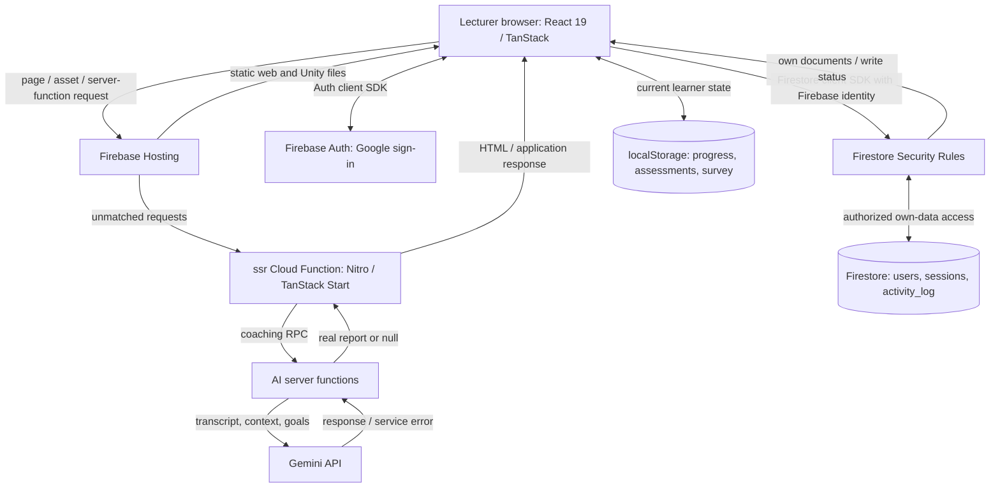
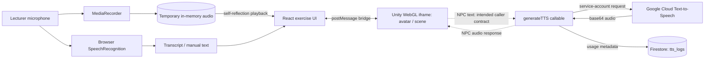
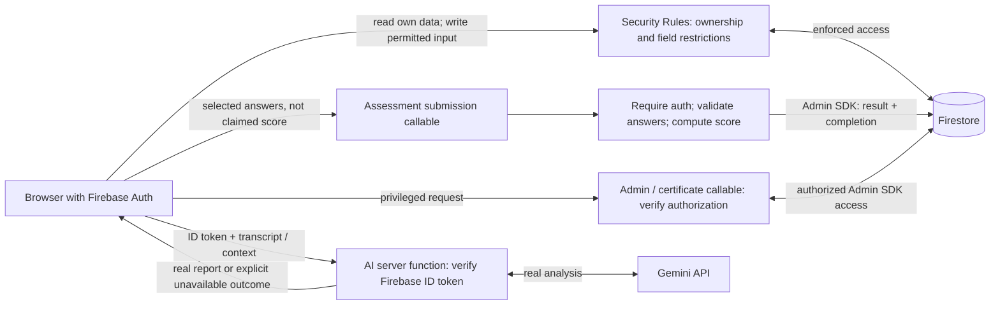
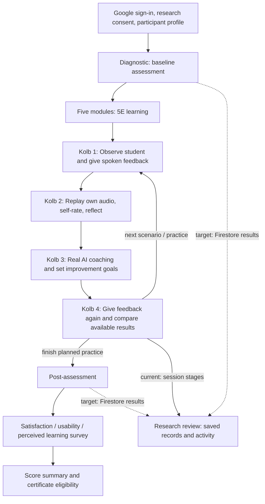
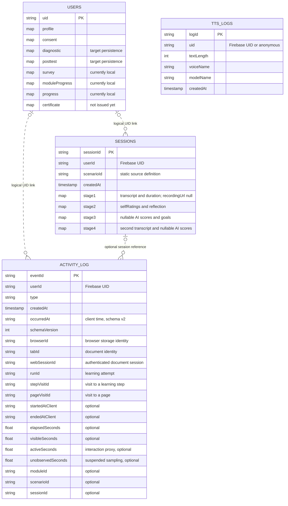
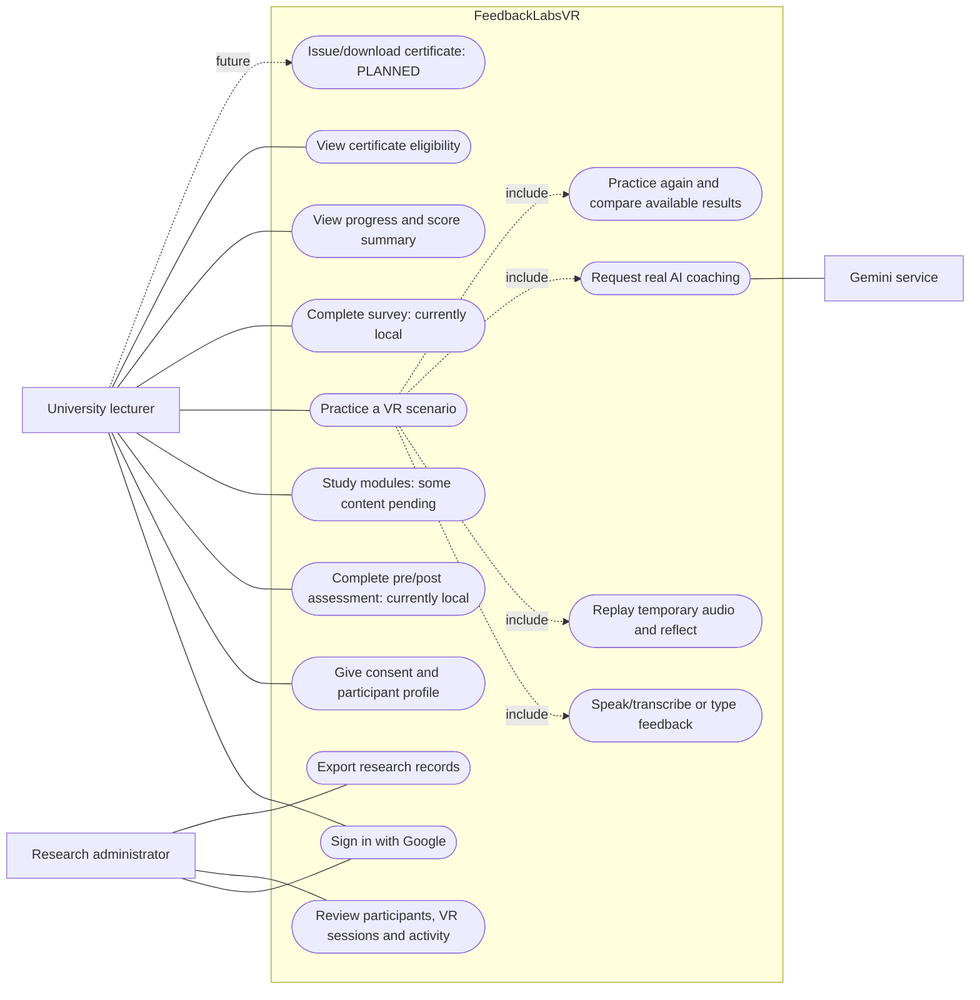

# FeedbackLabsVR — System Diagrams

Updated: 2026-09-17. Read alongside [PROJECT_CONTEXT.md](PROJECT_CONTEXT.md), which defines implementation status and agreed decisions. Diagrams labelled **Current** describe inspected source, not a verified deployment. Diagrams labelled **Target** include pending implementation.

Exported figures: [offline SVG gallery](docs/diagrams/index.html) · [figure guide and captions](docs/diagrams/README.md). Twelve figures are available as SVG, high-resolution PNG and editable Mermaid. Regenerate with `python scripts/generate-diagrams.py`.

Mermaid blocks are editable diagram sources. Use the declared state labels when exporting them into academic documents.

## 1. System Architecture — Current

### 1.1 Web, identity, persistence and AI



There is no current SSR → Auth → Firestore request chain for learner data. Firebase identity is held by the client SDK; private learner/admin layouts set `ssr: false`. Auth and learner route beforeLoad checks await Firebase identity and a UID-scoped Firestore setup read before rendering. Completed participants skip consent/onboarding; the remaining local overview is reconciled before display. Setup submissions await durable writes and invalidate the setup cache. The AI server functions have CSRF protection but no verified Firebase caller check yet.

Sources: `firebase.json`, `functions/src/index.ts`, `src/lib/firebase.ts`, `src/lib/learner.functions.ts`, `src/lib/ai.functions.ts`, `src/start.ts`.

### 1.2 Unity and audio



Raw learner audio has no upload/store path. Object URLs are released when replaced or the exercise unmounts. The transcript goes to AI; the recorded Blob does not. Browser-provider transcription can require a network service.

The TTS endpoint exists, but its Unity caller implementation and SALSA lip-sync internals are outside this checkout, so those arrows are dashed. Caller authentication is currently disabled in TTS; service-account authentication to Google is a separate mechanism. An iframe visual placeholder must never be confused with an AI mock result.

Sources: audio hooks, `UnityPlayer.tsx`, `useUnityBridge.ts`, `public/unity-build/index.html`, `functions/src/index.ts`.

### 1.3 Research administrator

```mermaid
flowchart LR
  admin["Admin browser: Firebase signed-in user"]
  call["Firebase callable endpoints"]
  gate["requireAdmin: server email allowlist"]
  sdk["Firebase Admin SDK"]
  db[("Firestore: users, sessions, activity_log")]
  view["Participant behavior / Learning Log / Activity Log"]
  export["Filtered CSV / JSON datasets and research codebook"]

  admin -->|"callable with Auth token"| call --> gate
  gate -->|"authorized request"| sdk
  sdk <-->|"cross-user reads"| db
  sdk -->|"serialized timestamps and records"| view
  view --> admin
  view --> export
```

The Admin SDK bypasses Security Rules; authorization belongs in each endpoint. UI visibility is not authorization. `adminCheckAccess` only reports the caller's own admin status and is separate from these protected data reads.

Sources: `src/lib/admin.functions.ts`, `src/routes/admin/`, `functions/src/index.ts`.

## 2. Backend Access — Target

**Decision:** retain direct client reads/writes for permitted own data. Add trusted callable submission for pre/post results and authoritative completion. Keep AI orchestration in TanStack server functions with verified caller identity. No generic authenticated SSR database proxy is planned.



The assessment callable and AI authentication in this diagram are not implemented. Before moving final results, restrict owner writes to server-managed fields. Current rules permit an owner to edit the entire user document. The chosen latest-result maps do not preserve answer/attempt history; such history needs a separate schema decision.

Rationale and official Firebase references: [backend access decision](PROJECT_CONTEXT.md#4-backend-access-decision).

## 3. System Framework — Intended Learning Design



5E = Engage → Explore → Explain → Elaborate → Evaluate. Modules 2–5 currently have placeholder content. There are five scenario definitions, but Unity implementation coverage is not verified here. This is the intended curriculum order, not a claim that every prerequisite is enforced by the server.

No AI evaluation is displayed during reflection. AI receives text/context, not audio features. Diagnostic/posttest measure empathy, clarity, motivation and actionability; VR uses a distinct four-dimension rubric. Missing AI results must remain visible rather than be replaced. Certificate generation is future work.

Sources: `modules.tsx`, `vr-simulation.tsx`, `learner.functions.ts`, `certificate.tsx`.

## 4. ERD — Current Collections and Declared Document Shape

Firestore is a document database. The following is a logical relationship diagram, not SQL tables or enforced foreign keys. Embedded maps stay in `users`; `stage1`–`stage4` stay in `sessions`.



A participant identity can have many sessions and events. The corresponding `users` document may not exist yet: Auth login does not create a complete `UserDoc`, and writes occur independently. This explains the optional logical links.

`tts_logs` is deliberately unlinked: current records can be anonymous. There are no audio-file entities or populated scenario/module collections established by this code. A session holds both speaking rounds of one Kolb run; repeat-round history is not separately modeled. Full AI narrative reports currently remain in React state.

The detailed field list and persistence status are in [Project Context §5](PROJECT_CONTEXT.md#5-current-persistence-and-data-model).

## 5. User Use Cases — Current Features and Planned Issuance

Mermaid flowcharts approximate UML use-case diagrams here; actor associations are lines, and labelled `include` links indicate required sub-activities of the intended exercise.



AI failure is an alternate outcome of requesting coaching, not a synthetic success. Audio replay is available when a recording exists; manual text entry does not produce audio. No audio upload/download use case is required. Current S2–S5 AI triggering has a known defect described in Project Context §9.

## 6. Data Flow Diagrams - Current Levels 0-2

The authoritative DFD package is [DFD Levels 0-2](docs/diagrams/DFD.md), including SVG, PNG, editable Mermaid and a machine-readable flow manifest. Convention: Level 0 is the context diagram; Level 1 contains five main processes; Level 2 expands all five with balanced inputs and outputs.

| Parent process | Level 2 decomposition |
|---|---|
| 1.0 Identity and setup | 1.1 Authenticate; 1.2 Read/save setup; 1.3 Resolve access/log |
| 2.0 Learning and assessments | 2.1 Load state; 2.2 Process input; 2.3 Save/present |
| 3.0 VR practice and coaching | 3.1 Capture/replay; 3.2 Coaching/NPC audio; 3.3 Save stages |
| 4.0 Usage event persistence | 4.1 Measure/identify; 4.2 Queue/retry; 4.3 Persist/verify |
| 5.0 Research reporting | 5.1 Authorize/read; 5.2 Transform/filter; 5.3 Present/export |

Store identifiers D1-D7 are defined in the DFD guide. In particular, D4 is local learner state, D5 is temporary audio memory and D7 is the durable activity queue. They are not Firestore collections.

### 6.1 Supplementary AI behavior within process 3.2 (not another DFD level)

```mermaid
flowchart TD
  input["Transcript, context, goals, available prior round"]
  config{"Required input and API key available?"}
  call["Call real Gemini with response schema"]
  service["Gemini response"]
  retry{"Retryable failure and retries remain?"}
  delay["Backoff: 1s, 2s, 4s, 4s"]
  parse["Parse JSON and normalize fields"]
  report["Real response-derived report"]
  unavailable["Return null: AI unavailable"]
  ui["UI: result, or unavailable values shown as -"]

  input --> config
  config -->|"yes"| call
  config -->|"no"| unavailable
  call --> service
  service -->|"response text"| parse
  service -->|"429 / 503 / transport error"| retry
  service -->|"other HTTP failure / empty output"| unavailable
  retry -->|"yes, up to four retries"| delay --> call
  retry -->|"no"| unavailable
  parse -->|"parsing exception"| unavailable
  parse -->|"parsed response"| report
  report --> ui
  unavailable --> ui
```

**Current limitation:** normalization accepts some incomplete JSON through defaults (missing scores → 0, invalid emotion → neutral). This diagram does not claim strict runtime validation. Prior-score request construction also uses zeros when data is unavailable.

**Required correction:** validate complete report fields; preserve missing prior data; return null for invalid analysis; show an explicit Thai failure message and retry option. Never introduce an AI mock/heuristic/fallback result. The current retry loop has no per-fetch or total request deadline, so it cannot guarantee a maximum response time.

Sources: `src/lib/ai.server.ts`, `src/lib/ai.functions.ts`, `src/routes/_authenticated/vr-simulation.tsx`.

## Usage timing and simultaneous sessions - current (2026-09-17)

```mermaid
flowchart LR
  auth["Authenticated browser document"] --> context["Random browser / tab / webSession IDs"]
  context --> track["Pages, heartbeat, visibility, idle, learning steps"]
  track --> queue["Per-event local queue: ID, UID, client occurredAt"]
  queue -->|"retry under same UID and event ID"| rules["Firestore client SDK + ownership rules"]
  rules --> events[("activity_log: immutable event + server createdAt")]
  events --> admin["Authorized admin callable reads"]
  admin --> research["Web sessions, step times, bounded observed overlaps"]
```



These identities are fields on events, not new Firestore collections. Different browser IDs do not prove different physical devices. Missing end events do not prove continued usage. See [USAGE_TRACKING.md](USAGE_TRACKING.md) for exact interval, retry and filtering definitions.
