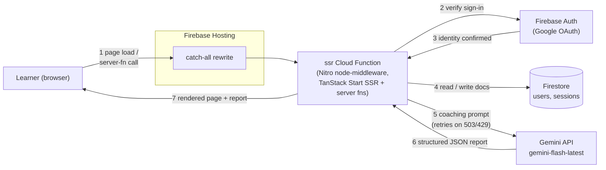
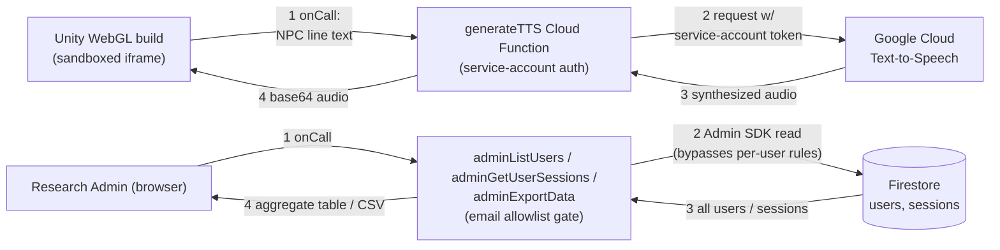
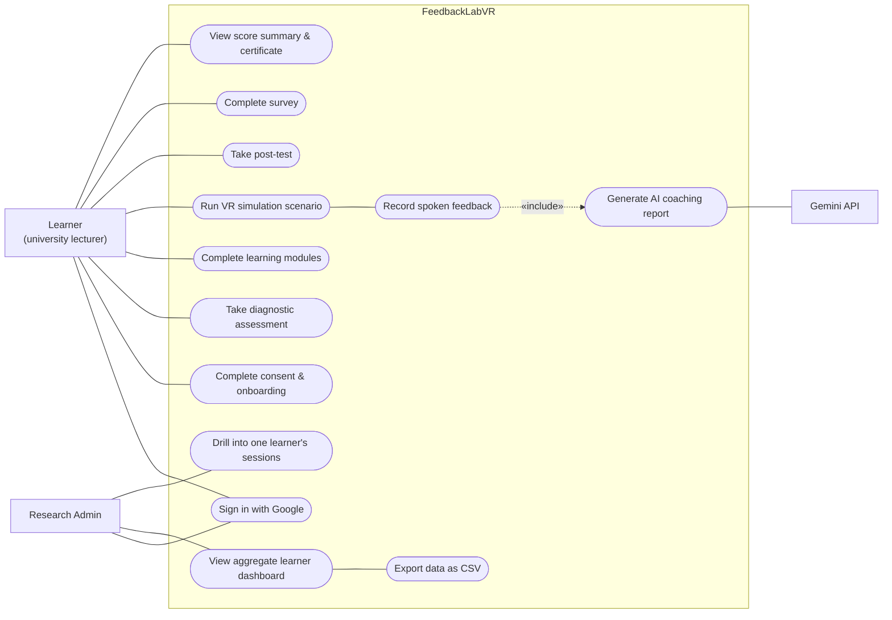
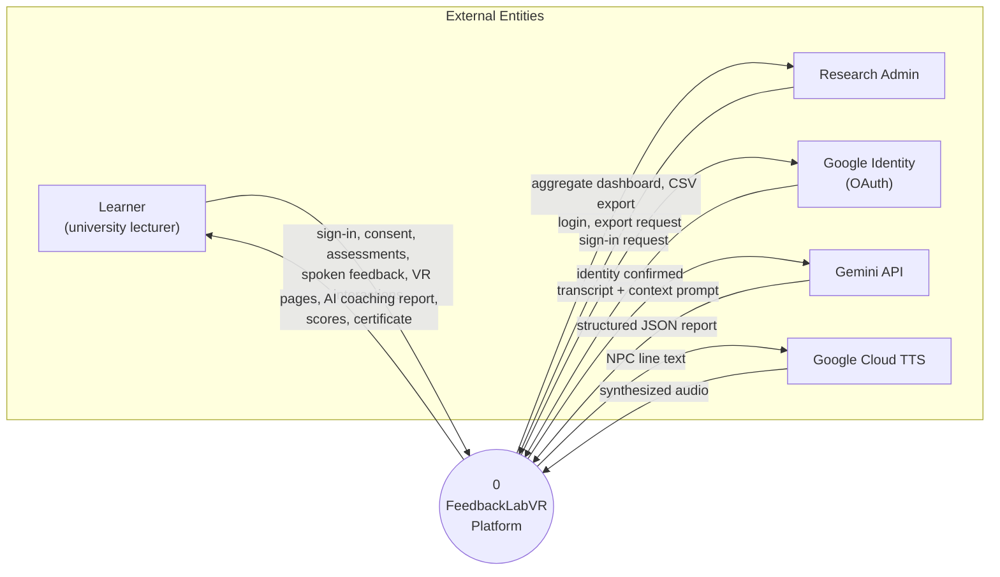
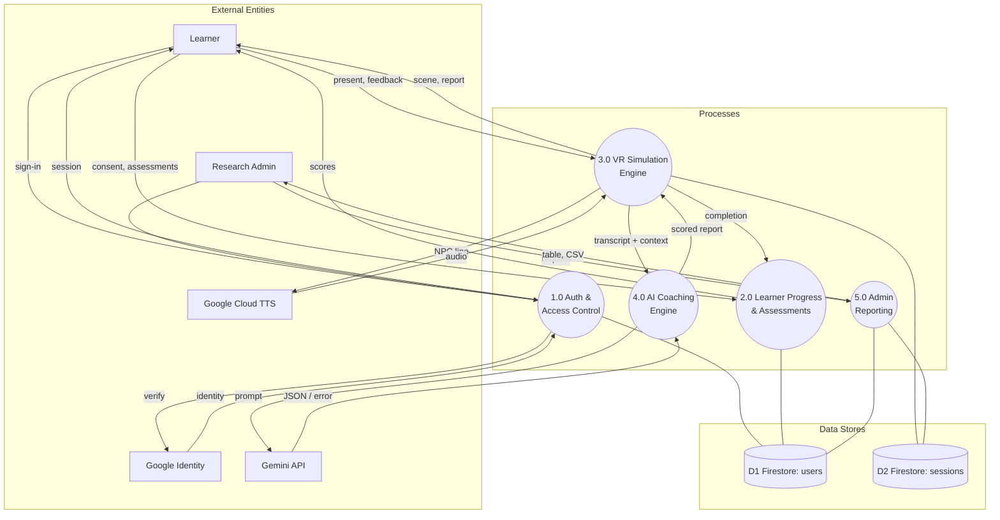
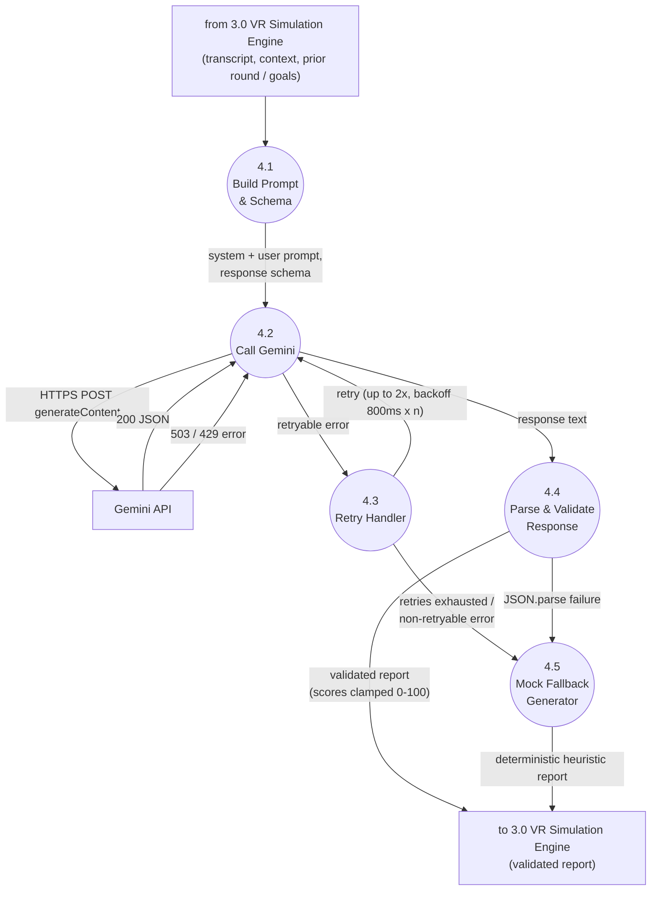

# System Diagrams — FeedbackLabVR

Every diagram below is plain text (Mermaid). Edit the text, the picture updates — no drawing tool, nothing to keep in sync by hand. To view: GitHub renders these fences inline automatically; VS Code shows them live with the "Markdown Preview Mermaid Support" extension; or paste any block into [mermaid.live](https://mermaid.live) to tweak and export as PNG/SVG for a slide deck.

Each section names the real files it's drawn from, so it can be checked against the code rather than taken on faith.

---

## 1. Tech Stack

| Layer | Technology |
|---|---|
| Client | React 19, TypeScript, Tailwind CSS v4, Radix UI primitives, Recharts |
| Routing / server functions | TanStack Router + TanStack Start 1.x (file-based routes, `createServerFn`) |
| Client state / data fetching | TanStack Query |
| 3D / VR layer | Unity WebGL build, embedded via `<iframe>`, `postMessage` bridge |
| Application server | Nitro (`node-middleware` preset) — bundles TanStack Start's SSR + server functions into one Node handler |
| Backend platform | Firebase: Hosting, Auth (Google sign-in), Firestore, Cloud Functions (2nd gen, Node 22), Cloud Storage (rules provisioned; no current data flow uses it) |
| AI services | Gemini API (`gemini-flash-latest`) for coaching/scoring; Google Cloud Text-to-Speech for NPC voice |
| Tooling | Vite, ESLint + Prettier, TypeScript strict, Zod (server-fn input validation) |

*Source: `package.json`, `functions/package.json`, `firebase.json`.*

---

## 2. System Architecture Diagram

Split into the two request paths that actually exist, instead of one crowded diagram — they barely share any nodes, so drawing them together only added crossing lines. Arrows are numbered in call order.

### 2a. Web & AI Request Path

### 2b. VR Audio & Admin Path

*Source: `functions/src/index.ts`, `src/lib/ai.server.ts`, `src/hooks/useUnityBridge.ts`, `firebase.json`.*

---

## 3. Use Case Diagram

Mermaid has no native UML use-case shape, so actors are plain nodes and use cases are stadium ovals inside the system boundary — same information, standard workaround.

*Source: `src/routes/_authenticated/*.tsx`, `src/routes/admin/*.tsx`.*

---

## 4. Data Flow Diagrams

**Legend, used consistently across all three levels:** rectangle = external entity, circle = process, cylinder = data store. Entities, processes, and stores are each grouped in their own cluster so the eye can separate "who's involved" from "what happens" from "what's stored" at a glance.

### 4.1 Level 0 — Context Diagram

### 4.2 Level 1 — System Decomposition

### 4.3 Level 2 — Process 4.0 "AI Coaching Engine" Expanded

This is the part worth showing a client in detail: it's the actual retry/fallback logic behind why the app never hard-fails when Gemini returns a `503`.

*Source: `src/lib/ai.server.ts` (`callGeminiJson`, `generateCoachingReport`, `generateRoundTwoReport`, `generateFinalSummary`), `src/lib/firestore.ts`, `functions/src/index.ts`.*
